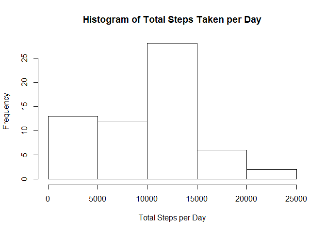
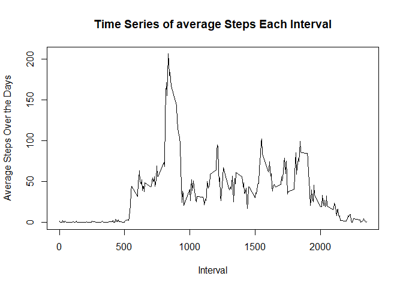
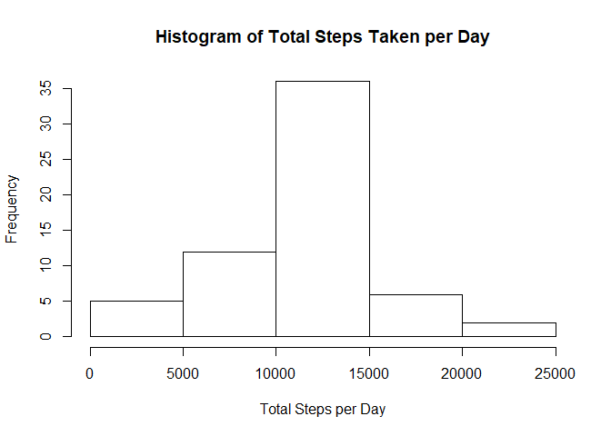
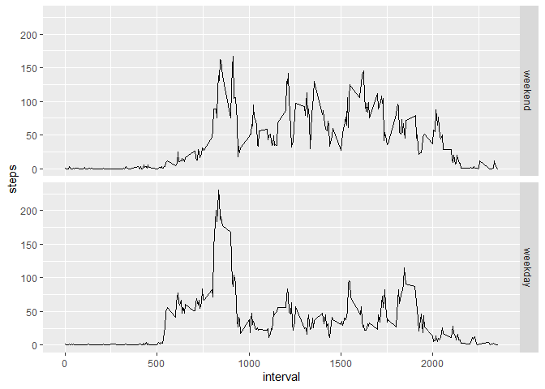

We first download and unzip the file and then read it into a dataframe
in R:

    download.file("https://d396qusza40orc.cloudfront.net/repdata%2Fdata%2Factivity.zip", destfile = "data.zip", mode = "wb")
    unzip("data.zip")
    activity <- read.csv("activity.csv")

The next step is to calculate all of the value we need for the plot:

    days <- group_by(activity,date) #creating group by date

    #finding total steps per day
    total.steps <- summarise(days,sum(steps, na.rm = TRUE))

    ## `summarise()` ungrouping output (override with `.groups` argument)

    names(total.steps) <- c("date","steps")
    avgsteps <- mean(total.steps$steps) #mean
    medsteps <- median(total.steps$steps) #median

The results show that the mean total number of steps taken a day is ‘r
avgsteps’ and the median is ‘r medsteps’ and the plot is as below:

    hist(total.steps$steps, main = "Histogram of Total Steps Taken per Day", xlab = "Total Steps per Day")

next, we will calculate the average number of steps for each interval
across all days and plot it:

    minint <- group_by(activity, interval)
    dayavg <- summarise(minint,mean(steps, na.rm = TRUE))

    ## `summarise()` ungrouping output (override with `.groups` argument)

    names(dayavg) <- c("interval","steps")
    plot(dayavg$interval,dayavg$steps,type = 'l', main = "Time Series of average Steps Each Interval", xlab = "Interval", ylab = "Average Steps Over the Days")

    maxavgsteps <- dayavg$interval[which.max(dayavg$steps)] 

as you can see from the plot, the average maximum steps occurs at
interval 835

    missing <- sum(!complete.cases(activity))

and the total number of missing cases is 2304

Now we will make a new dataset which is equal to the existing one but
with the missing values filled in with the average steps for that
interval:

    newact <- activity
    naind <- which(is.na(activity$steps))
      for (i in 1:length(naind))
      {
        indx <- naind[i]
        newact$steps[indx] <- dayavg$steps[dayavg$interval == newact$interval[indx]]
      }
    newdays <- group_by(newact,date) 
    newtotal.steps <- summarise(newdays,sum(steps, na.rm = TRUE))

    ## `summarise()` ungrouping output (override with `.groups` argument)

    names(newtotal.steps) <- c("date","steps")
    newavgsteps <- mean(newtotal.steps$steps)
    newmedsteps <- median(newtotal.steps$steps)

    hist(newtotal.steps$steps, main = "Histogram of Total Steps Taken per Day", xlab = "Total Steps per Day")

As seen from the histogram above, the mean total number of steps taken a
day is ‘r newavgsteps’ and the median is ’r newmedsteps\`. The histogram
also shows that with the newly filled in data, the plot takes on a more
normal distribution with most values in the middle and less towards the
extremes.

Next up, we will investigate if there are differences in activity
patterns between weekdays and weekends.

    daysoftheweek <- c("Monday", "Tuesday", "Wednesday", "Thursday", "Friday")
    newweek <- mutate(newact, weekday = factor((weekdays(as.Date(activity$date)) %in% daysoftheweek), levels=c(FALSE, TRUE), labels=c('weekend', 'weekday')))

    lastdata <- group_by(newweek,weekday,interval)
    weeksteps <- summarise(lastdata,mean(steps))

    ## `summarise()` regrouping output by 'weekday' (override with `.groups` argument)

    names(weeksteps) <- c("weekday","interval","steps")

    ggplot(weeksteps, aes(x = interval, y = steps)) +
          geom_line() +
          facet_grid(weekday ~ .)

The plot shows that the activity patterns are similar on weekdays and
weekends but much more movement is recorded between the intervals of 500
and 800 on weekdays as well as a higher peak at about 800. However,
movement after 1000 and before 2100 is slightly higher for weekends.
